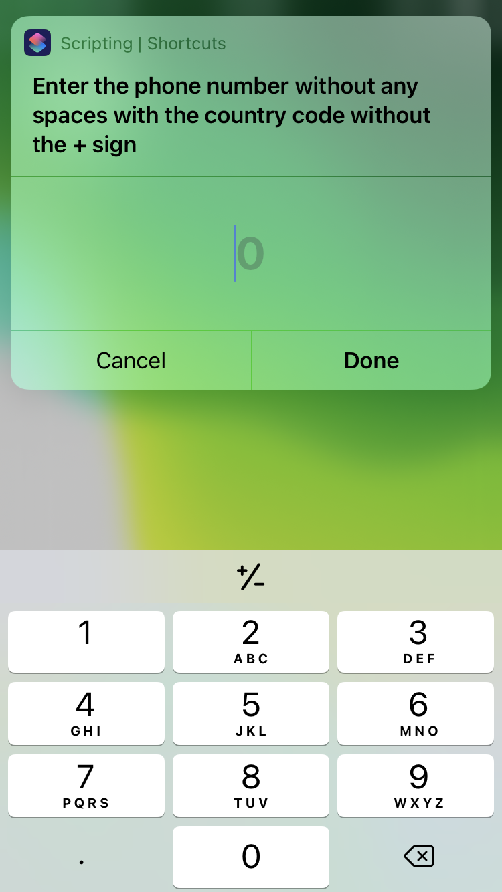
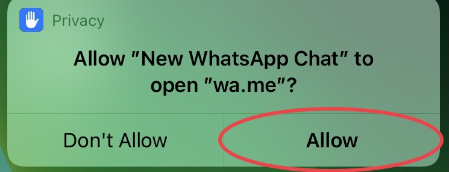
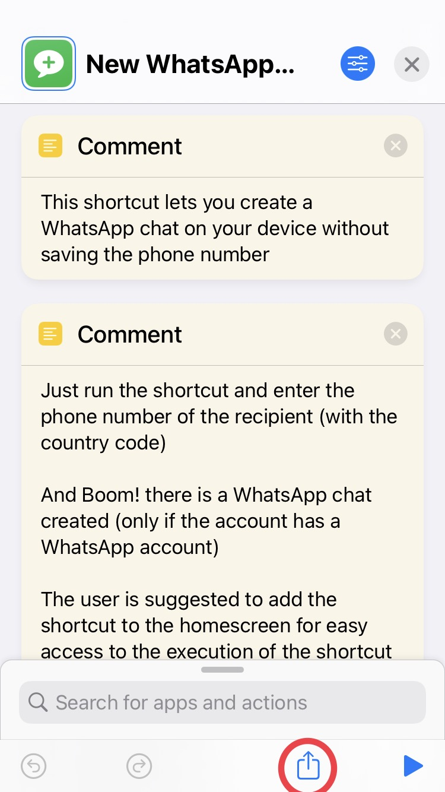
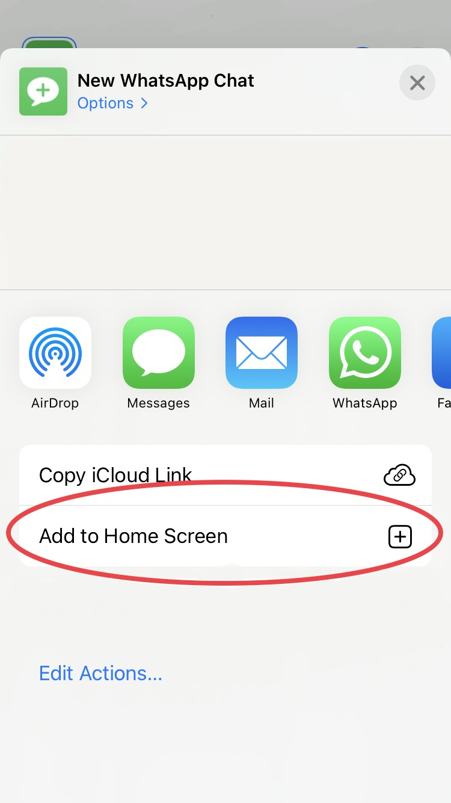

# Shortcut to create a new WhatsApp chat

This shortcut lets you create a WhatsApp chat with unknown numbers without saving a contact.
This can be best used if you want to immediately message anyone and only temporarily.
This shortcut can also be used for messaging people even if you have them in your contacts.

> You can save the shortcut to your device using the file on the [releases](https://github.com/dhivijit/whatsapp-chat-shortcut/releases/tag/main) page or via the [iCloud link](https://www.icloud.com/shortcuts/500bef1cf0e84424aaac2ebe1f4df9d8), I suggest to save the shortcut using the file.
> 
> You require iOS 15 or greater to add the shortcut using the file.
 
---

## Running the shortcut

When you want to create a chat, just execute the shortcut enter the phone number of the recipient with the country code but without the + sign.

---

### First Run

- Just execute the shortcut and you will be asked to enter the phone number with the country code and press done

- You will get a dialog to give it the permission to access a webpage. You will get this dialog only on your first run and not anymore. You have to press allow to make the shortcut work

- After giving it the permission, your will be taken into the WhatsApp and you will see this dialog

- And Boom!!!, Your chat is created. Now you can chat with a person without saving their phone number.

### Easy Access of the shortcut

You may want to execute the shortcut easily without going to the shortcuts app all the time for creating a new whatsapp chat

You need to do the following steps to get easy access

- Click the button which is marked with the red circle

- Now click the button 'Add to Home Screen'

- You will be asked with what name and image you want to add that shortcut to your home screen. You may click add directly if you don't want to customize it.

- And after doing that the shortcut will be added to the home screen

- Now you can execute the shortcut to save whatever you copied

---
> All the screenshots are taken on an iPhone running iOS 15. The above steps can be different if your device is running other OS
